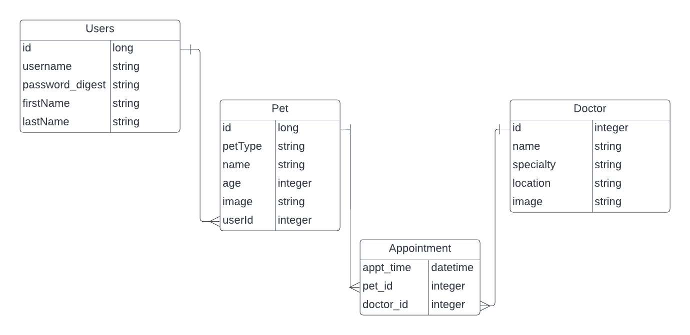
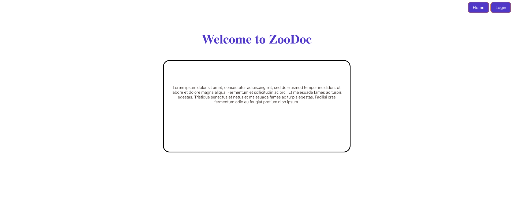
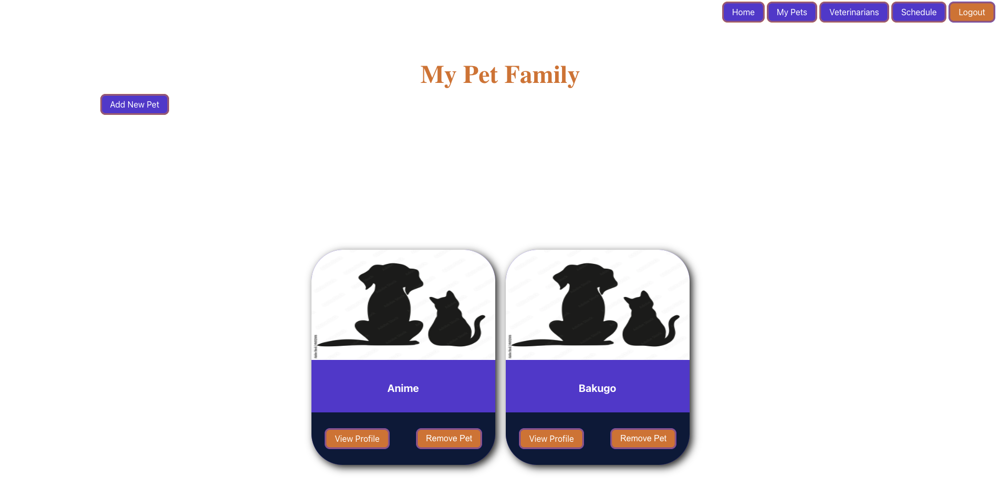
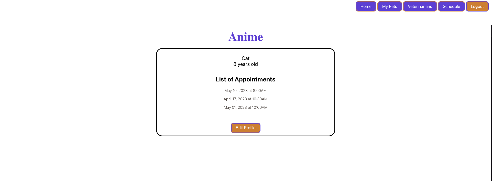
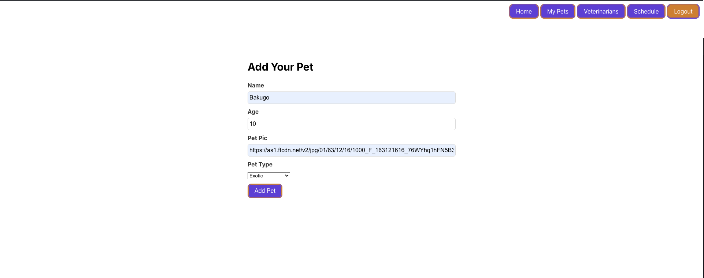
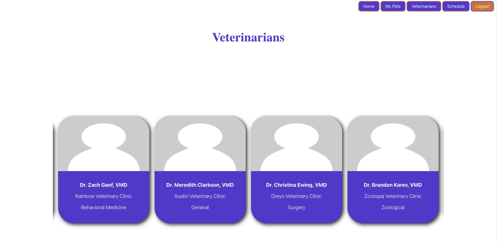
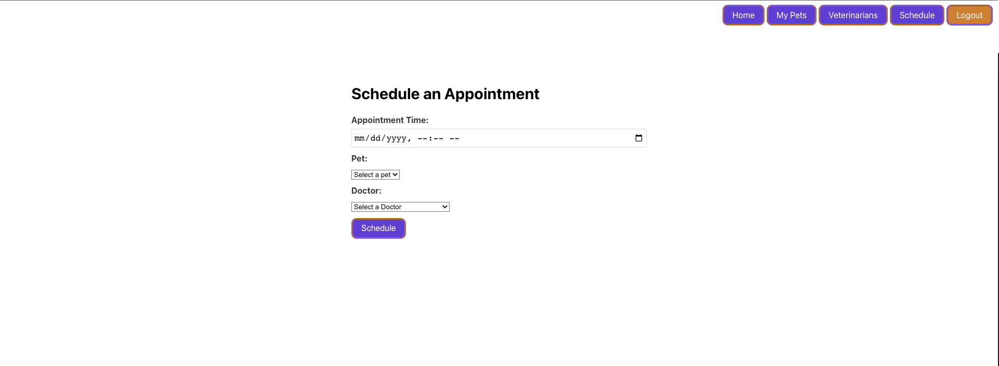

# ZooDoc Application

This is a full-stack application focused on Veterinary Medicine that allows authenticated users or new users to create pet profiles, view their pet profiles, view a list of veterinary professionals and schedule appointments for their pet with a veterinarian. If the user does not have an account, they can create an account and if successful, the user will be directed to create a new pet profile to get started with the application. If the user has an account, they can login and will be navigated to a page with a list of their pets. The user can update their pets profile, add a new pet or remove a pet, as well as, schedule appointments for their pets with one of the available veterinarians. 

## Technology

-Built with React.js, Ruby on Rails, CSS, Active Record, SQLite

## Installation
### Steps
1. Fork and clone this repo to your local device. Open the folder in two seperate terminals to run the front and backend. In both terminal ensure you are in the zoodoc folder then in one terminal run bundle install. Once that is completed, in the same terminal run rails s. This will begin running the backend.
2. In your 2nd terminal inside of zoodoc, run: npm install --prefix client. This will install the necessary node files to run the frontend. Once that is complete, run: npm start --prefix client. This will launch the frontend or client facing application on the browser. 

## ERD

## Screenshots
### Home

### Pets

### Profile

### AddPet

### Vets

### AddAppt
